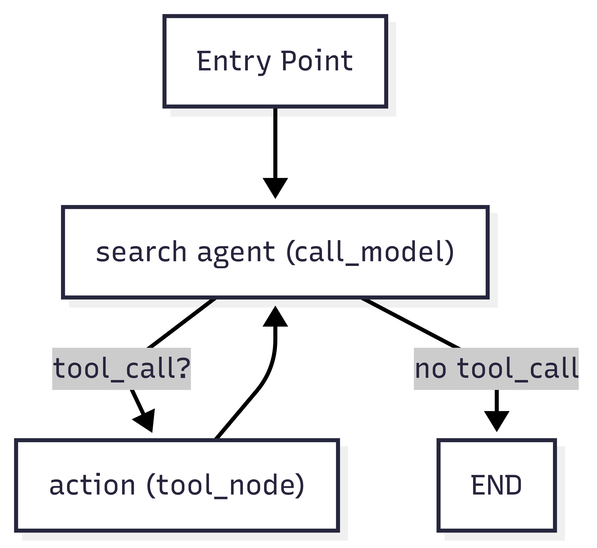

# Review Insights Automation

Automated pipeline for collecting, analyzing, and reporting on customer reviews for car dealerships, using Google Maps data and AI-powered summarization.

---

## Repository Structure


```
.env                        # Environment variables
.gitignore                  # Git ignore rules
requirements.txt            # Python dependencies
ai_agents.py                # AI agent logic (NEW)
ai_chat_models.py           # AI models for review summarization and report generation
algorithms.py               # Data processing and report formatting logic
api_queries.py              # (Reserved for API integrations)
main.py                     # Command-line interface and entry point (NEW)
report.py                   # Main pipeline orchestration
cache_data/                 # Cached data (JSON, JSONL)
  ├─ LDV_places.jsonl       # Example cache file
  ├─ LDV_places_backup_...  # Backup cache file
  └─ sample.json            # Sample cache data
reports/                    # Generated PDF reports
  └─ september_report_...   # Example report
utils/                      # Utilities and Google Maps Scraper
  ├─ gms_input.txt          # Input queries for scraper
  ├─ GMS_README.md          # Scraper documentation
  ├─ google_maps_scraper    # Scraper binary (Linux)
  ├─ google_maps_scraper.exe# Scraper binary (Windows)
  └─ webdata/               # Scraper database files
    ├─ jobs.db              # Main database
    ├─ jobs.db-shm          # DB shared memory
    └─ jobs.db-wal          # DB write-ahead log
__pycache__/                # Python bytecode cache
```

---

## Workflow Overview

1. **Data Collection**  
   Use [Google Maps Scraper](utils/GMS_README.md) to extract dealership reviews:
   - Configure queries in `utils/gms_input.txt`
   - Run the scraper to output JSON/JSONL files in `cache_data/`

2. **Data Processing**  
   - [`algorithms.py`](algorithms.py):  
     - Parse and filter dealership/review data
     - Prepare input for analysis and reporting

3. **AI-Powered Analysis & Reporting**  
   - [`ai_chat_models.py`](ai_chat_models.py):  
     - Summarize reviews
     - Generate sentiment analysis and actionable insights
     - Create detailed markdown reports

4. **Report Generation**  
   - [`report.py`](report.py):  
     - Orchestrates the pipeline
     - Outputs PDF reports to `reports/`

---

## Usage

**This project utilizes [*Ollama*](https://ollama.com/download). Please download and install it from their official website.**

The scraper uses **WSL2** when the script detects a Windows platform. Hence WSL2 is required.

### 1. Install Dependencies

```sh
pip install -r requirements.txt
```

### 2. Configure Environment

- Set up `.env` with required API keys (i.e. `GOOGLE_API_KEY`, `TAVILY_API_KEY`, `SERP_API_KEY`).

### 3. Run Google Maps Scraper

See [utils/GMS_README.md](utils/GMS_README.md) for command-line options and usage examples.


### 4. Run the Pipeline or CLI

You can run the main pipeline or use the CLI for custom options:

```sh
python main.py           # Run the CLI (see `python main.py -h` for options to adjust parameters)
python report.py         # Or simply run the default pipeline
```
- Outputs PDF report in `reports/` directory.

---

## Guiding AI Models: Representative Examples

You may check `ai_chat_model.py` for the approaches that I did for guiding AI models for business review analysis. Below are some representative examples of how prompts and templates were crafted to steer model behavior.

### 1. Review Summarization
**Prompt Engineering:**
The `REVIEW_SUMMARY_TEMPLATE` instructs the AI to produce concise, neutral summaries, avoid fluff, and highlight specific strengths, weaknesses, and recommendations. It enforces strict output length and format, and even guides the tone to be professional and neutral-to-positive.

**Example Template Excerpt:**
```
You are a concise review-summarization assistant.
Task: Given a list of json reviews produce a **brief review summary** for human readers.
Requirements:
1. No fluff, answer the question directly.
2. Output **one to four sentences** (aim for ~25-125 words). Keep it short.
3. Be specific on the strengths, weaknesses, and recommendations if there are any.
...etc.
```

### 2. Sentiment Analysis & Recommendations
**Chain-of-Thought Reasoning:**
The `REVIEWS_ANALYSIS_TEMPLATE` and `MODELS_ANALYSIS_TEMPLATE` guide the AI to extract themes, quantify evidence, and generate actionable recommendations. The prompt enforces output as pure JSON, with explicit keys for sentiment summary, metrics, themes, recommendations, and confidence notes. This ensures the model's output is structured, measurable, and ready for downstream automation.

**Example Template Excerpt:**
```
Required output would be a JSON object with these keys:
- `brief_sentiment_analysis_summary` (string, 1-2 sentences)
- `overall_metrics` (object: ...)
- `themes` (array of objects): ...
- `recommendations` (array): ...
- `confidence_and_gaps` (string): ...
Rules & constraints:
- Pure JSON output starting with a left curly bracket { and ends with a right curly bracket }
- Use only facts in `data`. Do **not** invent or infer details not present.
```

### 3. Report Generation
**Structured Output & Flow:**
The `REPORT_WRITING_TEMPLATE` guides the AI to produce a multi-page, markdown-formatted business report, including an executive summary, detailed analysis, and actionable recommendations. The prompt explicitly requests an outline, then the full report, ensuring logical flow and completeness.

**Example Template Excerpt:**
```
Task:
1. You should first come up with an outline for the report that describes the structure and flow of the report.
2. Then, generate the report and return that as your final output.
3. Make sure the report includes an executive summary, complete details including the review analysis, and actionable recommendations.
```

### 4. Model Selection & API Usage
**Best Practices:**
While I carefully thought out what kind of models to use, one of the limitations I had was to use smaller models (e.g., `qwen2.5:32b`, `gemini-2.0-flash`) as I locally hosts and run the LLMs. Other than that, there are error handling as well to ensure only valid outputs are used. Prompts are always paired with system and human messages for context-rich interactions and prioritized task handling.

---

### Car Model Reviews via Search Agent Feature (Optional)
Currently, there is a feature that searches the internet for specific car models, compiles and creates a summary. These are then will become part of the output report. Here's a diagram how the agent is implemented.



This is done through acyclics langchain graph utilizing an agent with Tavily tool. However, since there is feedback loop, usage could be quite large.

It is optional by default due to its likely-to-be-heavy usage and can be activated via `-include-car-models`. More on parameters below.

---

## Main.py Optional Parameters

| Argument                | Type    | Default                          | Description                                                      |
|-------------------------|---------|----------------------------------|------------------------------------------------------------------|
| `-m`                    | int     | current month                    | Month as integer (1-12). Specify which month's reviews to process.|
| `-reuse-cache`          | flag    | False                            | If set, reuses cached data for input processing.                  |
| `-scrape_dir`           | string  | `./cache_data/LDV_places.jsonl`  | Path to the JSONL file containing scraped review data.            |
| `-include-car-models`  | flag    | False                            | Include car model review summaries in the report.                 |

**Example usage:**
```sh
python main.py -m 9 -reuse-cache -scrape_dir ./cache_data/LDV_places.jsonl -include-car-models
```

If no arguments are provided, defaults will be used. See `python main.py -h` for help.

## Key Files & Functions


- [`main.py`](main.py): Command-line interface and entry point for automation and custom runs.
- [`algorithms.process_input`](algorithms.py): Loads and filters dealership review data.
- [`ai_chat_models.generate_review_summary`](ai_chat_models.py): Summarizes reviews using AI.
- [`ai_chat_models.generate_reviews_analysis`](ai_chat_models.py): Produces sentiment analysis and recommendations.
- [`ai_chat_models.generate_md_report`](ai_chat_models.py): Generates markdown report.
- [`algorithms.make_pdf`](algorithms.py): Converts markdown to PDF.
- [`report.pipeline`](report.py): Main pipeline entry point.

---

## Notes

- Scraper binaries for Windows and Linux are included in `utils/`.
- Cached data and generated reports are not tracked by git (see [.gitignore](.gitignore)).
- For scraper details and advanced options, see [utils/GMS_README.md](utils/GMS_README.md).

---

## Further Automate via Cron Job

To schedule automatic report generation at the end of each month, add the following cron job (Linux/macOS):

```sh
30 23 28-31 * * [ "$(date +\%d -d tomorrow)" == "01" ] && python /path/to/main.py
```

This runs `main.py` at 23:30 on the last day of each month. Adjust `/path/to/main.py` as needed.